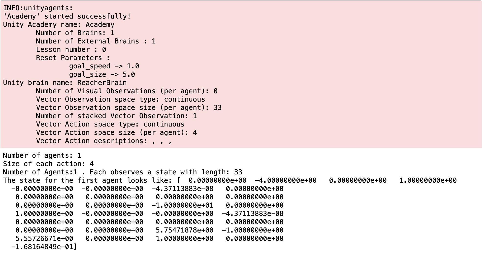
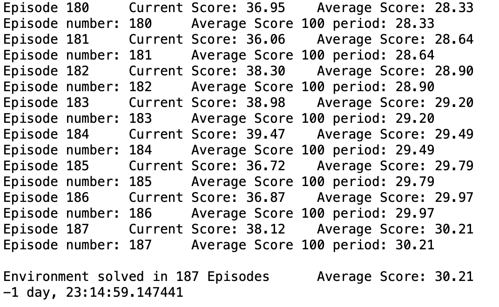
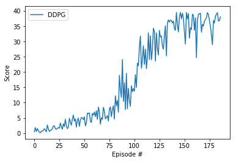

## Report
Reinforcement learning algorithm

1. [Optimized Navigation notebook](https://github.com/Pytrader1x/AI_Deep_Reinforcement/blob/master/Optimal_Continuous_Control.ipynb)

2. [Optimized Model](https://github.com/Pytrader1x/AI_Deep_Reinforcement/blob/master/model.py)

3. [RL Actor Agent](https://github.com/Pytrader1x/AI_Deep_Reinforcement/blob/master/agent.py)

The input is the vector of states as show below:

# Model architecture:
- Architecture of Actor Network

- Overall there are 2 layers that are hidden and one output layer
each hidden layer has 128 hidden units and is after there's a ReLU activation layer

- Size of input  = 33
- Size of output  = 4

- After the first layer there's a batch normalization layer, 
after the output layer we have a tanh activation layer

# Architecture of Critic Network

- 2 hidden layers and one output layer
each hidden layer has 128 hidden units and is followed by a ReLU activation layer

- Size of input = 4
- Size of output = 1

- We have a batch normalization layer after the first layer
output layer is followed by a linear activation unit

# Hyperparameters:

- BUFFER_SIZE = int(1e5)  # replay buffer size

- BATCH_SIZE = 128        # minibatch size

- GAMMA = 0.99            # discount factor

- TAU = 1e-3              # for soft update of target parameters

- LR_ACTOR = 2e-4         # learning rate of the actor

- LR_CRITIC = 2e-4        # learning rate of the critic

- WEIGHT_DECAY = 0  

# Learning Algorithm

We initialize the local Actor and Critic network. The actor network does the policy approximation while the critic does the value estimation. We copy those generated weights to the target Actor and target Critic network after every iteration. In the acting step, the agent passes the state vector through the Actor network and takes the action which is the output of the network. 

In the learning step, the Critic network is used as a feedback to the Actor network to change its weights such that the estimated value of the input state is maximized. 
Architecture of Actor Network

input layer size = 33
output layer size = 4

Overall there are 2 hidden layers & 1 output layer

each hidden layer has 128 hidden units and is followed by a ReLU activation layer
We have a batch normalization layer after the first layer
output layer is followed by a tanh activation layer

# The Architecture of the Critic Network

input size = 4
output size = 1
Two hidden layers plus one output layer where
the hidden layers have 128 hidden units, these are followed by a ReLU activation layer

After the first layer I put a batch normalization layer to help convergence + a linear activation layer

# Install

You can clone the env by running git clone https://github.com/Pytrader1x/AI_Deep_Reinforcement

The environment can be downloaded from one of the links below for all operating systems

- Linux: - [click here](https://s3-us-west-1.amazonaws.com/udacity-drlnd/P2/Reacher/one_agent/Reacher_Linux.zip)

- Mac OSX: [click here](https://s3-us-west-1.amazonaws.com/udacity-drlnd/P2/Reacher/one_agent/Reacher.app.zip)

- Windows (32-bit): [click here](https://s3-us-west-1.amazonaws.com/udacity-drlnd/P2/Reacher/one_agent/Reacher_Windows_x86.zip)

- Windows (64-bit): [click here](https://s3-us-west-1.amazonaws.com/udacity-drlnd/P2/Reacher/one_agent/Reacher_Windows_x86_64.zip)

- For AWS: To train the agent on AWS (without enabled a virtual screen), use this link to obtain the "headless" version of the environment. The agent can not be watched without enabling a virtual screen, but can be trained. (To watch the agent, one can follow the instructions to enable a virtual screen, and then download the environment for the Linux operating system above.)

# Overview
In this env we have a robotic arm with 2 moveable joints which will be the inputs for targeting the robot agents hand to move to the target sphere

Reward: The robotic agent will received a reward of + 0.1 for each step in the training that the robots hand is in the target sphere

Goal: The goal of your agent is to maintain its position at the target location for as many time steps as possible.

Observation Space: The observation space consists of 33 variables corresponding to position, rotation, velocity, and angular velocities of the arm. Each action is a vector with four numbers, corresponding to torque applicable to two joints.

Action Space: Every entry in the action vector should be a number between -1 and 1.

In order to consider the environment has been solved, the agent must get an average score of +30 over 100 consecutive episodes.

## Results

## Optimized DQN agent

# Future research:

- Ideas for Future Work

- Optimise hyperparameterts to get to a reward of +35 and fast convergence

- In addition we can explore deeper trials of Distributed Distributional Deterministic Policy Gradients and also potentially also trialing
PPO Proximal policy optimization for faster convergence

